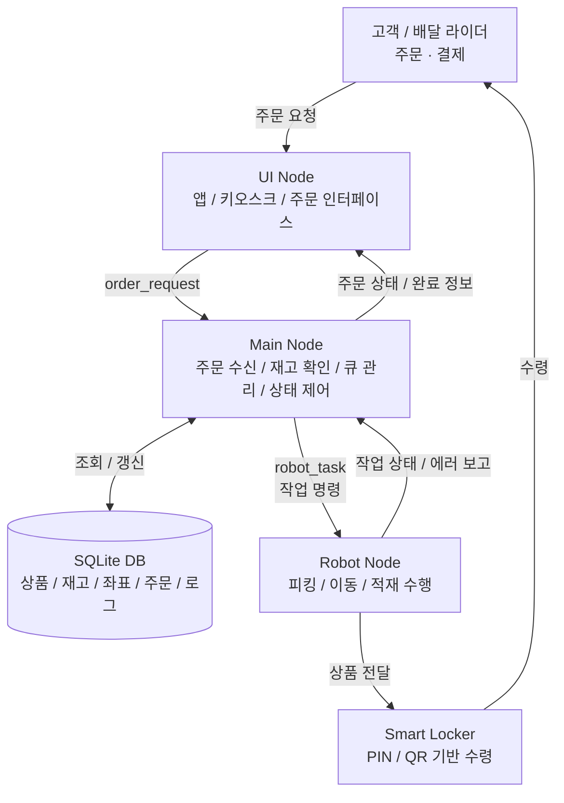
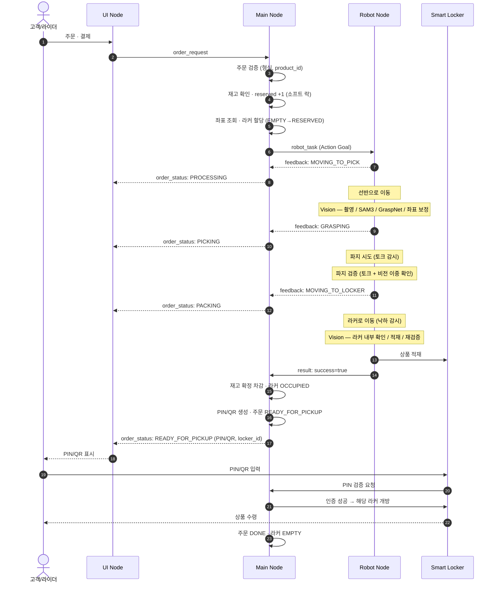
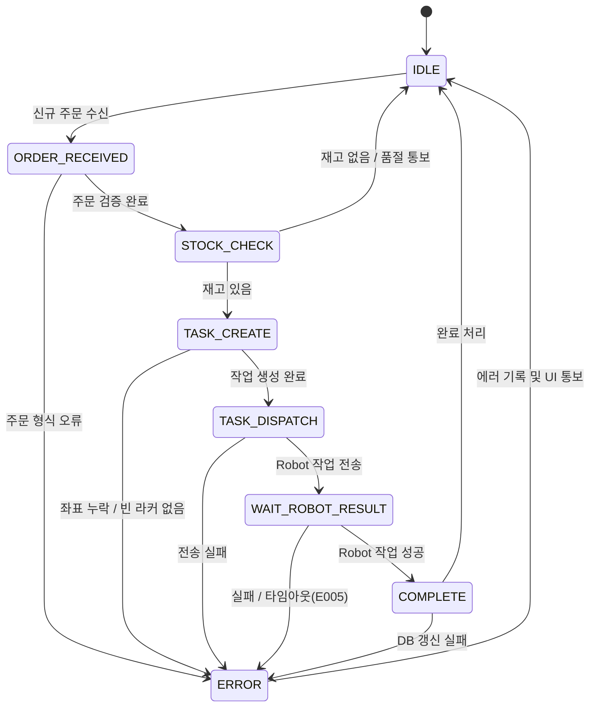
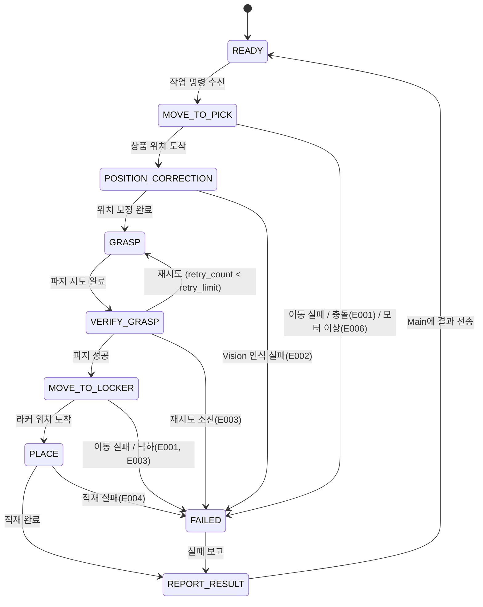

# SUDO

> 고객 공간과 로봇 작업 공간을 물리적으로 분리한 도심형 마이크로 풀필먼트 센터(MFC) 기반 무인 자동화 시스템

SUDO는 단순한 무인 판매기가 아닙니다. 고객은 상품 진열 공간에 직접 접근하지 않고, 앱·키오스크 주문 인터페이스를 통해 상품을 주문합니다. 중앙 제어 시스템(Main)이 주문을 처리하고, 로봇이 상품을 피킹하여 스마트 라커로 전달하면, 고객 또는 배달 라이더가 PIN/QR 코드로 상품을 수령합니다.

---

## 1. 핵심 설계 원칙

SUDO는 **중앙 집중식 제어** 구조입니다. 모든 판단은 Main에서만 이루어지며, 각 노드의 책임이 명확하게 분리되어 있습니다.

| 주체 | 성격 | 역할 |
|------|------|------|
| **UI** | 입출력 | 주문 요청과 상태 표시만 담당 (판단 기능 없음) |
| **Main** | 판단 | 주문 처리, 재고 판단, 작업 상태 관리, DB 접근, 예외 처리 |
| **Robot** | 실행 | Main이 내린 작업 명령만 수행 |

**불변 규칙**

- 모든 판단은 Main에서만 이루어진다.
- DB 접근은 Main만 허용한다. (UI·Robot 직접 접근 금지)
- UI ↔ Robot 직접 통신을 금지한다. 모든 정보는 Main을 거친다.
- Robot은 Main의 명령 없이 동작하지 않으며, 자의적으로 작업 순서를 바꾸지 않는다.

**흐름 방향**

- 명령 흐름: `UI → Main → Robot → Smart Locker`
- 상태 흐름: `Smart Locker → Robot → Main → UI`

---

## 2. 시스템 구성

### 2.1 전체 시스템 흐름도



### 2.2 모듈 구조

```
Customer
   ↓
UI Node
   ↓
Main Node ↔ SQLite DB
   ↓
Robot Node
   ↓
Smart Locker
   ↓
Customer
```

### 2.3 핵심 노드 (초기 MVP 기준)

| 노드 | 책임 |
|------|------|
| `ui_node` | 주문 입력, 주문 진행 상태 표시, 품절/실패/완료 메시지 표시, PIN/QR 출력 |
| `main_node` | 주문 수신·검증, 주문 큐 관리, 재고 확인, DB 접근, 상태 머신, 로봇 명령 생성, 완료 처리, 로그 기록 |
| `robot_node` | 상품 위치 이동, 피킹, 위치 보정, 라커 적재, 작업 결과 보고 |

### 2.4 robot_node 내부 모듈

```
robot_node
 ├ motion_control          # 이동 제어
 ├ gripper_control         # 그리퍼 제어
 ├ vision_correction       # 카메라 / SAM3 / GraspNet / 좌표 보정
 ├ task_executor           # 작업 단계 실행
 └ hardware_status_monitor # 모터·토크·충돌 감시
```

초기 MVP에서는 비전을 `robot_node` 내부 기능으로 둡니다. 이후 비전 처리량이 커지거나 독립적인 모델 관리가 필요해지면 별도 `vision_node`로 분리할 수 있습니다.

---

## 3. 전체 서비스 흐름 (정상 흐름)

### 3.1 순차 다이어그램



### 3.2 단계별 상세

| STEP | 담당 | 내용 |
|------|------|------|
| 1 | 고객 → UI | 상품 선택 및 결제 완료 |
| 2 | Main | 주문 검증 — product_id 존재 여부, quantity(1 이상), request_source 유효성 |
| 3 | Main ↔ DB | 재고 확인 및 예약 — `가용 재고 = stock_count − reserved_count`, 소프트 락 `reserved_count +1` |
| 4 | Main ↔ DB | 작업 생성 — 상품 좌표 조회 + 빈 라커 할당 (EMPTY → RESERVED) |
| 5 | Main → Robot | `/robot_task` Action Goal 전송, 타임아웃 타이머 시작 (기본 5분) |
| 6 | Robot | 선반으로 이동 (MOVING_TO_PICK), 하드웨어 지속 감시 |
| 7 | Robot Vision | 촬영 → SAM3 객체 탐지 → GraspNet 파지 좌표 계산 → 좌표 보정 |
| 8 | Robot | 파지 시도, 토크 센서로 힘 실시간 감지 |
| 9 | Robot | 파지 검증 — 토크 센서 + 비전 재확인 이중 검증 (둘 다 통과해야 성공) |
| 10 | Robot | 라커로 이동 (MOVING_TO_LOCKER), 상품 낙하 감시 |
| 11 | Robot Vision | 라커 내부 확인 → 적재 → 비전 재검증 |
| 12 | Robot → Main | 작업 성공 결과 보고, 홈 포지션 복귀 |
| 13 | Main ↔ DB → UI | 재고 확정 차감 → 라커 OCCUPIED → PIN/QR 생성 → 주문 READY_FOR_PICKUP → UI 완료 통보 |
| 14 | 고객/라이더 | PIN/QR로 라커 수령 → 주문 DONE |

---

## 4. ROS2 통신 인터페이스

| 방향 | 인터페이스 | 방식 | 내용 |
|------|-----------|------|------|
| UI → Main | `/order_request` | Service | 신규 주문 요청 |
| Main → UI | `/order_status` | Topic | 주문 상태 실시간 전달 |
| Main → Robot | `/robot_task` | Action Goal | 작업 명령 (상품·위치·라커·재시도 한도) |
| Robot → Main | `/robot_task/feedback` | Action Feedback | 단계별 진행 상태 보고 |
| Robot → Main | `/robot_task/result` | Action Result | 최종 성공/실패 및 에러 코드 |
| Main ↔ DB | 내부 함수 | SQLite | 재고·좌표·주문·라커·로그 |

로봇 작업은 시간이 걸리는 동작이므로 단순 Topic보다 **Action 구조**를 사용합니다. (작업 시작 요청 / 진행 피드백 / 성공·실패 결과 반환 / 중간 취소 가능)

### 공통 메시지 구조 (초안)

```
OrderRequest      : order_id, product_id, quantity, request_source
OrderStatus       : order_id, status, message, pin_code, locker_id
RobotTask         : task_id, order_id, product_id, quantity,
                    pick_location_id, place_location_id, retry_limit
RobotTaskStatus   : task_id, order_id, status, success, error_code, message
```

---

## 5. 상태 머신

### 5.1 Main 상태 머신



| 상태 | 수행 내용 | 성공 전환 | 실패 전환 |
|------|----------|----------|----------|
| IDLE | 주문 큐 대기 | ORDER_RECEIVED | — |
| ORDER_RECEIVED | 주문 ID 생성, 형식 검증 | STOCK_CHECK | ERROR |
| STOCK_CHECK | DB 재고 확인, 소프트 락 | TASK_CREATE | IDLE (품절) |
| TASK_CREATE | 좌표·라커 조회, 작업 레코드 생성 | TASK_DISPATCH | ERROR |
| TASK_DISPATCH | Robot에 Action Goal 전송 | WAIT_ROBOT_RESULT | ERROR |
| WAIT_ROBOT_RESULT | 결과 대기, 타임아웃 감시 | COMPLETE | ERROR / TIMEOUT |
| COMPLETE | 재고 차감, PIN/QR 생성, UI 완료 통보 | IDLE | ERROR |
| ERROR | 실패 기록, UI 에러 통보, 예약 해제 | IDLE | — |

### 5.2 Robot 상태 머신



| 상태 | 수행 내용 | 실패 조건 |
|------|----------|----------|
| READY | Main 명령 대기 | — |
| MOVE_TO_PICK | 선반 좌표로 이동, 하드웨어 감시 | 이동 실패, 충돌, 모터 이상 |
| POSITION_CORRECTION | 촬영, SAM3, GraspNet, 좌표 보정 | 신뢰도 미달, Depth 이상, 후보 없음 |
| GRASP | 그리퍼 접근 및 파지, 토크 감시 | 과압착, 접근 실패 |
| VERIFY_GRASP | 토크 + 비전 이중 파지 확인 | 토크 미달, 상품 미감지 |
| MOVE_TO_LOCKER | 라커로 이동, 낙하 감시 | 이동 실패, 낙하 감지 |
| PLACE | 라커 내부 확인, 적재, 비전 재검증 | 공간 인식 실패, 적재 후 미감지 |
| REPORT_RESULT | Main에 결과 보고, 홈 복귀 | 통신 실패 |
| FAILED | 실패 기록, 보고 대기 | — |

파지 검증 실패 시 그리퍼를 열고 재시도하며(`retry_count < retry_limit`), 재시도 한도 소진 시 FAILED로 전환합니다.

---

## 6. 예외 처리 및 에러 코드

| 코드 | 원인 | 발생 조건 |
|------|------|----------|
| E001 | 이동 실패 | 경로 이탈, 장애물 충돌, 목표 좌표 도달 불가 |
| E002 | Vision 인식 실패 | SAM3 신뢰도 미달, Depth 데이터 이상, GraspNet 후보 없음 |
| E003 | 파지 실패 | 허공 파지, 토크 임계값 미달, 비전 재확인 실패 (재시도 소진 후) |
| E004 | 라커 적재 실패 | 내부 공간 인식 불가, 적재 후 상품 미감지 |
| E005 | 통신 타임아웃 | WAIT_ROBOT_RESULT 타임아웃 경과 |
| E006 | 하드웨어 이상 | 모터 이상, 센서 오류 |

에러 발생 시 Main 공통 처리: `reserved_count -1`, 라커 할당 해제(RESERVED → EMPTY), 에러 로그 기록, UI에 ERROR 전송, IDLE 복귀. 하드웨어 이상(E006)·이동 실패(E001)는 관리자 확인 로그를 추가로 남깁니다.

별도 예외:

- **품절**: 가용 재고가 0이면 로봇 작업을 생성하지 않고 Main 단계에서 즉시 차단, UI에 OUT_OF_STOCK 전송.
- **PIN 만료/미수령**: Main이 `pin_expires_at`를 주기적으로 감시하여 만료 시 주문 EXPIRED 처리, 라커 EMPTY 전환, 관리자 확인 로그 기록. 라커 내 상품 회수는 관리자 판단에 위임.

---

## 7. 데이터베이스 (SQLite)

DB는 **Main만 접근**합니다. 본 흐름에서 참조되는 주요 테이블·컬럼은 다음과 같습니다.

**products**
`product_id`, `product_name`, `price`, `stock_count`, `reserved_count`(소프트 락), `shelf_id`, `is_available`

**locations**
`location_id`, `shelf_id`, `x, y, z`, `rx, ry, rz`, `description`

**lockers**
`locker_id`, `locker_status`(EMPTY / RESERVED / OCCUPIED), `assigned_order_id`

**orders**
`order_id`, `product_id`, `quantity`, `order_status`(RECEIVED / PROCESSING / PICKING / PACKING / READY_FOR_PICKUP / DONE / EXPIRED / ERROR), `locker_id`, `pin_code`, `pin_expires_at`, `created_at`, `completed_at`

**robot_tasks**
`task_id`, `order_id`, `product_id`, `pick_location_id`, `place_location_id`, `task_status`(CREATED / DISPATCHED / IN_PROGRESS / DONE / FAILED / ERROR), `retry_count`, `error_code`, `created_at`, `completed_at`

---

## 8. 기술 스택

- **ROS2** — 노드 간 통신 (Topic / Service / Action)
- **SQLite** — 상품·재고·좌표·주문·로그 저장
- **Vision** — Depth 카메라(RGB + Depth), SAM3(객체 탐지), GraspNet(파지 좌표 계산)

---

## 9. 개발 로드맵

- [ ] 전체 시스템 흐름도 확정
- [ ] Main FSM 확정
- [ ] Robot FSM 확정
- [ ] ROS2 Topic / Service / Action 확정
- [ ] 공통 메시지 정의 (interfaces 패키지)
- [ ] SQLite DB 스키마 정의
- [ ] 패키지 구조 설계
- [ ] 최소 동작 MVP 코드 작성

---

## 10. Pick & Place 현장 구현 (`dsr_realsense_pick_place`)

Doosan E0509 + RealSense + YOLO/FastSAM + RH-P12-RN 그리퍼 + 아두이노 초음파 센서로 동작하는 ROS 2 Humble 픽앤플레이스 스택입니다. 상세 실행 방법은 [`SETUP.md`](SETUP.md)를 참고하세요.

### 10.1 실행·종료 (권장)

```bash
# 시작 (종료 시 DRCF/DRL 자동 해제)
bash $(ros2 pkg prefix dsr_realsense_pick_place)/share/dsr_realsense_pick_place/scripts/run_pick_place_real.sh

# 직접 launch (Ctrl+C 시 launch_cleanup 자동 실행)
ros2 launch dsr_realsense_pick_place pick_place.launch.py mode:=real

# 수동 종료
bash $(ros2 pkg prefix dsr_realsense_pick_place)/share/dsr_realsense_pick_place/scripts/shutdown_nodes.sh --kill-launch

# Ctrl+C 후 그리퍼가 남았을 때
bash $(ros2 pkg prefix dsr_realsense_pick_place)/share/dsr_realsense_pick_place/scripts/launch_cleanup.sh
pgrep -af 'gripper_service|gripper_node'   # 출력 없으면 정상
```

`pkill -9`로 `ros2_control_node` / 그리퍼를 직접 죽이지 마세요. DRCF authority가 컨트롤러에 남아 **재연결 시 로봇 전원 사이클**이 필요해질 수 있습니다.

### 10.2 변경 이력 (2026-06-08)

#### A. GUI — 아두이노(초음파) 상태 표시

| 문제 | 조치 |
|------|------|
| 아두이노 연결 여부를 GUI에서 확인할 수 없음 | 좌측 상단 상태 바에 **ARD** 노드 추가 (`/ultrasonic_range` 3초 이내 수신 시 녹색) |
| 초음파 거리값이 화면에 없음 | 전류값 레이블 **위에** `초음파 거리: NN mm` 실시간 표시 |
| 런치 시 아두이노 노드 미기동 | `pick_place.launch.py`에 `ultrasonic_node` 포함 (`use_ultrasonic:=true`, `/dev/ttyACM0`, 9600 baud) |

관련 파일: `gui_node.py`, `ultrasonic_node.py`, `pick_place.launch.py`

#### B. 비전 — FastSAM 디버그 화면·ROI

| 문제 | 조치 |
|------|------|
| 카메라 HUD가 `realsense_fastsam_segment.py`와 다름 | `object_detector.py`에 `_render_scene()` 적용 (ROI 어둡게, known=녹색, unknown=컬러 마스크) |
| ROI 밖 검출·깜빡임 | ROI 360×240 필터, FastSAM `fastsam_every_n: 3`으로 프레임 스킵 (FPS 개선) |
| 좀비 `object_detector` 다중 실행 시 토픽 충돌 | 동일 토픽 퍼블리시 프로세스 중복 시 GUI 영상 불안정 — 기동 전 기존 프로세스 정리 필요 |

관련 파일: `object_detector.py`, `pick_place_params.yaml`

#### C. 픽 동작 — 초음파 기반 하강

| 문제 | 조치 |
|------|------|
| 고정 Z 하강만으로 파지 높이 부정확 | `pick_place_node` PICK 상태에서 **1 cm 단위 하강**, 초음파 ≤ 70 mm 시 그리퍼 close |
| 아두이노 출력 형식 상이 | `ultrasonic_node`가 `DIST:cm` / `Distance:NNmm` 둘 다 파싱, 기본 9600 baud |

관련 파일: `pick_place_node.py`, `ultrasonic_node.py`, `arduino/hc_sr04_sensor/`

#### D. 로봇 연결 해제 후 재기동 실패 (근본 수정)

**증상:** ROS 노드를 한 번 끊으면 DRCF authority / DRL(그리퍼) 세션이 컨트롤러에 남아, PC만 재런치해도 joint 활성화·그리퍼 초기화가 실패하고 **로봇 전원을 꺼야만** 복구되는 경우가 잦았음.

**원인 (구조적):**

1. **연결 소유권 분산** — `ros2_control`(DRCF `:12345`)와 `gripper_service`(DRL + TCP `:20002`)가 별도 프로세스인데 통합 teardown 없음
2. **잘못된 종료 순서** — 기존 `shutdown_nodes.sh`가 `ros2_control`을 먼저 kill → 그리퍼가 `DrlStop` 불가
3. **강제 kill** — `pkill -9`, `restart_gripper_bridge.sh`의 즉시 kill → `Drfl.close_connection()` / DRL 정리 미실행
4. **그리퍼 `close()`** — TCP SHUTDOWN만 하고 `DrlStop` 미호출 → 플랜지 RS-485 점유 잔류
5. **GUI 시스템 리셋** — launch 부모 프로세스는 살아 있는 채 자식만 죽이고 새 launch 중복 기동

**조치:**

| 파일 | 내용 |
|------|------|
| `scripts/shutdown_nodes.sh` | 종료 순서 전면 수정: `DrlStop` → gripper SIGTERM(12s) → vision → `ros2_control` SIGTERM(15s) → `--kill-launch` 시 launch 부모 종료 → 잔여만 SIGKILL |
| `scripts/run_pick_place_real.sh` | **신규** — Ctrl+C 포함 종료 시 위 shutdown 자동 실행 |
| `gripper_tcp_bridge.py` | `close()` 시 `stop_drl()` 항상 시도 |
| `gripper_service_node.py` | SIGTERM/SIGINT → `shutdown()` 후 즉시 종료 (`os._exit`) |
| `gripper_node.py`, `pick_place_node.py` | 종료 시 토크 OFF / `move_stop` |
| `scripts/launch_cleanup.sh` | launch `OnShutdown`(Ctrl+C) 시 고아 그리퍼·pick_place 정리 |
| `scripts/restart_gripper_bridge.sh` | `kill -9` 즉시 실행 → DrlStop → SIGTERM(10s) → 필요 시에만 kill -9 |
| `gui_node.py` | 시스템 리셋 시 `shutdown_nodes.sh --kill-launch` 사용 |

#### E. 그리퍼 기동 — 이벤트 기반 launch (2026-06-08)

고정 `TimerAction(10초)` 제거. `pick_place.launch.py`가 서비스 준비를 확인한 뒤 순서대로 기동합니다.

```
doosan_bringup ─┬─ wait_for_robot_ready.sh (/dsr01/drl/drl_start)
                └─ (병렬) realsense, detector, GUI …
                        ↓ 준비 완료
                gripper_service + gripper_node
                        ↓ OnProcessStart
                wait_for_gripper_ready.py (state.ready)
                        ↓ 준비 완료
                pick_place_node
```

런치 인자: `robot_ready_timeout_sec`(기본 120), `gripper_ready_timeout_sec`(기본 90).

초기화 파이프라인 자체(DRL 정지 ~5s + INITIALIZE)는 그대로이나, **로봇이 10초보다 빨리 붙으면 그만큼 앞당겨집니다.**

관련 파일: `pick_place.launch.py`, `scripts/wait_for_robot_ready.sh`, `scripts/wait_for_gripper_ready.py`

#### F. Ctrl+C 종료 시 그리퍼 노드 잔류

**증상:** 터미널에서 `ros2 launch`를 Ctrl+C로 끊으면 `gripper_service_node` / `gripper_node`만 살아 남음.

**원인:**

1. **이벤트 핸들러 기동** — `OnProcessExit`로 늦게 뜬 그리퍼가 launch 종료 시 SIGTERM을 못 받고 고아 프로세스가 됨
2. **`boot_bridge()` 블로킹** — DRL 초기화(수십 초) 중 `KeyboardInterrupt` 처리가 늦어 종료가 지연되거나 누락됨
3. **짧은 sigterm_timeout** — launch 기본 5초 안에 DrlStop 정리가 끝나지 않음

**조치:**

| 파일 | 내용 |
|------|------|
| `scripts/launch_cleanup.sh` | **신규** — `DrlStop` → gripper/pick_place/wait 스크립트 SIGTERM → 잔여 SIGKILL |
| `pick_place.launch.py` | `OnShutdown` → Ctrl+C 시 `launch_cleanup.sh` 자동 실행 |
| `gripper_service_node.py` | SIGINT/SIGTERM 시 `shutdown()` + **`os._exit(0)`** (`boot_bridge` 중에도 즉시 종료) |
| `gripper_node.py` | 동일 — 토크 OFF 시도 후 즉시 종료 |
| `pick_place.launch.py` | `gripper_service` sigterm_timeout **20초** (DRL 정리 여유) |

`run_pick_place_real.sh` 사용 시에는 기존처럼 `shutdown_nodes.sh --kill-launch`도 함께 실행됩니다.

#### G. 초음파 파지 거리 설정

파지 높이 임계값은 `mini_project/config/pick_place_params.yaml`의 `pick_place_node` 섹션에서 수정합니다.

```yaml
grasp_distance_m: 0.07    # m 단위. 0.07 = 70mm 이하에서 파지
ultrasonic_step_m: 0.01   # 1회 하강량 (m)
use_ultrasonic_grasp: true
```

수정 후 `pick_place_node` 재시작 또는 launch 재실행 필요.

### 10.3 주요 패키지·스크립트

| 경로 | 역할 |
|------|------|
| `mini_project/launch/pick_place.launch.py` | 전체 노드 런치 |
| `mini_project/dsr_realsense_pick_place/gui_node.py` | PyQt GUI |
| `mini_project/dsr_realsense_pick_place/object_detector.py` | YOLO + FastSAM 검출 |
| `mini_project/dsr_realsense_pick_place/pick_place_node.py` | 픽 FSM |
| `dsr_gripper_tcp/` | 그리퍼 TCP 브릿지 |
| `scripts/shutdown_nodes.sh` | 정상 종료 (DRCF/DRL 순서 해제) |
| `scripts/run_pick_place_real.sh` | 권장 기동 래퍼 (종료 시 shutdown 자동) |
| `scripts/launch_cleanup.sh` | Ctrl+C 후 고아 그리퍼 정리 |
| `scripts/wait_for_robot_ready.sh` | 런치 — DRL 서비스 준비 대기 |
| `scripts/wait_for_gripper_ready.py` | 런치 — gripper `ready` 대기 |
| `scripts/restart_gripper_bridge.sh` | 그리퍼만 복구 |
| `scripts/diagnose_drcf.py` | DRCF 연결 진단 |
| `mini_project/config/pick_place_params.yaml` | 초음파 파지 거리·픽 파라미터 |

---

## 11. Team

let-them-theory
