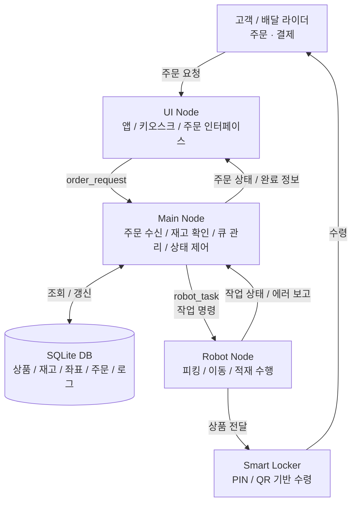
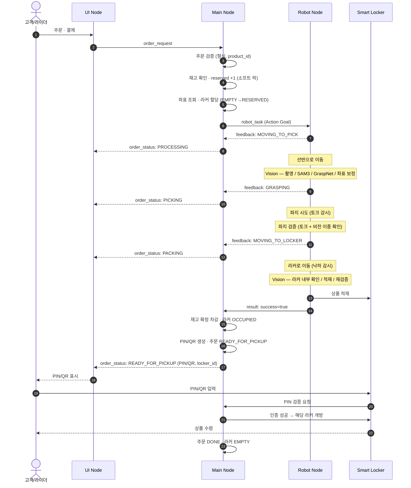
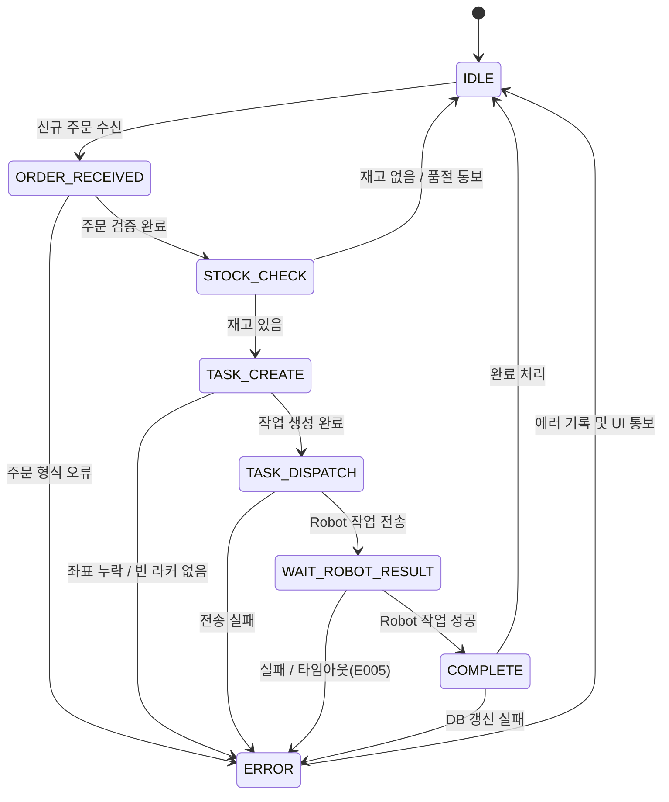
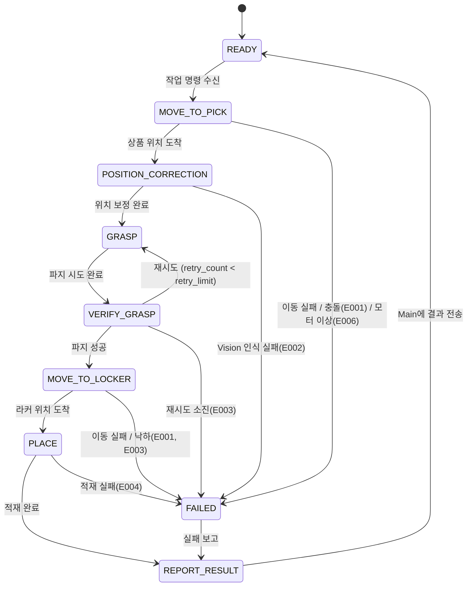

# SUDO

> 고객 공간과 로봇 작업 공간을 물리적으로 분리한 도심형 마이크로 풀필먼트 센터(MFC) 기반 무인 자동화 시스템

SUDO는 단순한 무인 판매기가 아닙니다. 고객은 상품 진열 공간에 직접 접근하지 않고, 앱·키오스크 주문 인터페이스를 통해 상품을 주문합니다. 중앙 제어 시스템(Main)이 주문을 처리하고, 로봇이 상품을 피킹하여 스마트 라커로 전달하면, 고객 또는 배달 라이더가 PIN/QR 코드로 상품을 수령합니다.

---

## 1. 핵심 설계 원칙

SUDO는 **중앙 집중식 제어** 구조입니다. 모든 판단은 Main에서만 이루어지며, 각 노드의 책임이 명확하게 분리되어 있습니다.

| 주체 | 성격 | 역할 |
|------|------|------|
| **UI** | 입출력 | 주문 요청과 상태 표시만 담당 (판단 기능 없음) |
| **Main** | 판단 | 주문 처리, 재고 판단, 작업 상태 관리, DB 접근, 예외 처리 |
| **Robot** | 실행 | Main이 내린 작업 명령만 수행 |

**불변 규칙**

- 모든 판단은 Main에서만 이루어진다.
- DB 접근은 Main만 허용한다. (UI·Robot 직접 접근 금지)
- UI ↔ Robot 직접 통신을 금지한다. 모든 정보는 Main을 거친다.
- Robot은 Main의 명령 없이 동작하지 않으며, 자의적으로 작업 순서를 바꾸지 않는다.

**흐름 방향**

- 명령 흐름: `UI → Main → Robot → Smart Locker`
- 상태 흐름: `Smart Locker → Robot → Main → UI`

---

## 2. 시스템 구성

### 2.1 전체 시스템 흐름도


```mermaid
flowchart TD
    A[고객 / 배달 라이더<br/>주문 · 결제] -->|주문 요청| B[UI Node<br/>앱 / 키오스크 / 주문 인터페이스]
    B -->|order_request| C[Main Node<br/>주문 수신 / 재고 확인 / 큐 관리 / 상태 제어]
    C <-->|조회 / 갱신| D[(SQLite DB<br/>상품 / 재고 / 좌표 / 주문 / 로그)]
    C -->|robot_task<br/>작업 명령| E[Robot Node<br/>피킹 / 이동 / 적재 수행]
    E -->|상품 전달| F[Smart Locker<br/>PIN / QR 기반 수령]
    F -->|수령| A
    E -->|작업 상태 / 에러 보고| C
    C -->|주문 상태 / 완료 정보| B
```

### 2.2 모듈 구조

```
Customer
   ↓
UI Node
   ↓
Main Node ↔ SQLite DB
   ↓
Robot Node
   ↓
Smart Locker
   ↓
Customer
```

### 2.3 핵심 노드 (초기 MVP 기준)

| 노드 | 책임 |
|------|------|
| `ui_node` | 주문 입력, 주문 진행 상태 표시, 품절/실패/완료 메시지 표시, PIN/QR 출력 |
| `main_node` | 주문 수신·검증, 주문 큐 관리, 재고 확인, DB 접근, 상태 머신, 로봇 명령 생성, 완료 처리, 로그 기록 |
| `robot_node` | 상품 위치 이동, 피킹, 위치 보정, 라커 적재, 작업 결과 보고 |

### 2.4 robot_node 내부 모듈

```
robot_node
 ├ motion_control          # 이동 제어
 ├ gripper_control         # 그리퍼 제어
 ├ vision_correction       # 카메라 / SAM3 / GraspNet / 좌표 보정
 ├ task_executor           # 작업 단계 실행
 └ hardware_status_monitor # 모터·토크·충돌 감시
```

초기 MVP에서는 비전을 `robot_node` 내부 기능으로 둡니다. 이후 비전 처리량이 커지거나 독립적인 모델 관리가 필요해지면 별도 `vision_node`로 분리할 수 있습니다.

---

## 3. 전체 서비스 흐름 (정상 흐름)

### 3.1 순차 다이어그램


```mermaid
sequenceDiagram
    autonumber
    actor C as 고객/라이더
    participant U as UI Node
    participant M as Main Node
    participant R as Robot Node
    participant L as Smart Locker

    C->>U: 주문 · 결제
    U->>M: order_request
    M->>M: 주문 검증 (형식, product_id)
    M->>M: 재고 확인 · reserved +1 (소프트 락)
    M->>M: 좌표 조회 · 라커 할당 (EMPTY→RESERVED)
    M->>R: robot_task (Action Goal)

    R-->>M: feedback: MOVING_TO_PICK
    M-->>U: order_status: PROCESSING
    Note over R: 선반으로 이동

    Note over R: Vision — 촬영 / SAM3 / GraspNet / 좌표 보정
    R-->>M: feedback: GRASPING
    M-->>U: order_status: PICKING
    Note over R: 파지 시도 (토크 감시)
    Note over R: 파지 검증 (토크 + 비전 이중 확인)

    R-->>M: feedback: MOVING_TO_LOCKER
    M-->>U: order_status: PACKING
    Note over R: 라커로 이동 (낙하 감시)
    Note over R: Vision — 라커 내부 확인 / 적재 / 재검증
    R->>L: 상품 적재

    R->>M: result: success=true
    M->>M: 재고 확정 차감 · 라커 OCCUPIED
    M->>M: PIN/QR 생성 · 주문 READY_FOR_PICKUP
    M-->>U: order_status: READY_FOR_PICKUP (PIN/QR, locker_id)
    U-->>C: PIN/QR 표시

    C->>L: PIN/QR 입력
    L->>M: PIN 검증 요청
    M->>L: 인증 성공 → 해당 라커 개방
    L-->>C: 상품 수령
    M->>M: 주문 DONE · 라커 EMPTY
```

### 3.2 단계별 상세

| STEP | 담당 | 내용 |
|------|------|------|
| 1 | 고객 → UI | 상품 선택 및 결제 완료 |
| 2 | Main | 주문 검증 — product_id 존재 여부, quantity(1 이상), request_source 유효성 |
| 3 | Main ↔ DB | 재고 확인 및 예약 — `가용 재고 = stock_count − reserved_count`, 소프트 락 `reserved_count +1` |
| 4 | Main ↔ DB | 작업 생성 — 상품 좌표 조회 + 빈 라커 할당 (EMPTY → RESERVED) |
| 5 | Main → Robot | `/robot_task` Action Goal 전송, 타임아웃 타이머 시작 (기본 5분) |
| 6 | Robot | 선반으로 이동 (MOVING_TO_PICK), 하드웨어 지속 감시 |
| 7 | Robot Vision | 촬영 → SAM3 객체 탐지 → GraspNet 파지 좌표 계산 → 좌표 보정 |
| 8 | Robot | 파지 시도, 토크 센서로 힘 실시간 감지 |
| 9 | Robot | 파지 검증 — 토크 센서 + 비전 재확인 이중 검증 (둘 다 통과해야 성공) |
| 10 | Robot | 라커로 이동 (MOVING_TO_LOCKER), 상품 낙하 감시 |
| 11 | Robot Vision | 라커 내부 확인 → 적재 → 비전 재검증 |
| 12 | Robot → Main | 작업 성공 결과 보고, 홈 포지션 복귀 |
| 13 | Main ↔ DB → UI | 재고 확정 차감 → 라커 OCCUPIED → PIN/QR 생성 → 주문 READY_FOR_PICKUP → UI 완료 통보 |
| 14 | 고객/라이더 | PIN/QR로 라커 수령 → 주문 DONE |

---

## 4. ROS2 통신 인터페이스

| 방향 | 인터페이스 | 방식 | 내용 |
|------|-----------|------|------|
| UI → Main | `/order_request` | Service | 신규 주문 요청 |
| Main → UI | `/order_status` | Topic | 주문 상태 실시간 전달 |
| Main → Robot | `/robot_task` | Action Goal | 작업 명령 (상품·위치·라커·재시도 한도) |
| Robot → Main | `/robot_task/feedback` | Action Feedback | 단계별 진행 상태 보고 |
| Robot → Main | `/robot_task/result` | Action Result | 최종 성공/실패 및 에러 코드 |
| Main ↔ DB | 내부 함수 | SQLite | 재고·좌표·주문·라커·로그 |

로봇 작업은 시간이 걸리는 동작이므로 단순 Topic보다 **Action 구조**를 사용합니다. (작업 시작 요청 / 진행 피드백 / 성공·실패 결과 반환 / 중간 취소 가능)

### 공통 메시지 구조 (초안)

```
OrderRequest      : order_id, product_id, quantity, request_source
OrderStatus       : order_id, status, message, pin_code, locker_id
RobotTask         : task_id, order_id, product_id, quantity,
                    pick_location_id, place_location_id, retry_limit
RobotTaskStatus   : task_id, order_id, status, success, error_code, message
```

---

## 5. 상태 머신

### 5.1 Main 상태 머신


```mermaid
stateDiagram-v2
    [*] --> IDLE
    IDLE --> ORDER_RECEIVED: 신규 주문 수신
    ORDER_RECEIVED --> STOCK_CHECK: 주문 검증 완료
    ORDER_RECEIVED --> ERROR: 주문 형식 오류
    STOCK_CHECK --> TASK_CREATE: 재고 있음
    STOCK_CHECK --> IDLE: 재고 없음 / 품절 통보
    TASK_CREATE --> TASK_DISPATCH: 작업 생성 완료
    TASK_CREATE --> ERROR: 좌표 누락 / 빈 라커 없음
    TASK_DISPATCH --> WAIT_ROBOT_RESULT: Robot 작업 전송
    TASK_DISPATCH --> ERROR: 전송 실패
    WAIT_ROBOT_RESULT --> COMPLETE: Robot 작업 성공
    WAIT_ROBOT_RESULT --> ERROR: 실패 / 타임아웃(E005)
    COMPLETE --> IDLE: 완료 처리
    COMPLETE --> ERROR: DB 갱신 실패
    ERROR --> IDLE: 에러 기록 및 UI 통보
```

| 상태 | 수행 내용 | 성공 전환 | 실패 전환 |
|------|----------|----------|----------|
| IDLE | 주문 큐 대기 | ORDER_RECEIVED | — |
| ORDER_RECEIVED | 주문 ID 생성, 형식 검증 | STOCK_CHECK | ERROR |
| STOCK_CHECK | DB 재고 확인, 소프트 락 | TASK_CREATE | IDLE (품절) |
| TASK_CREATE | 좌표·라커 조회, 작업 레코드 생성 | TASK_DISPATCH | ERROR |
| TASK_DISPATCH | Robot에 Action Goal 전송 | WAIT_ROBOT_RESULT | ERROR |
| WAIT_ROBOT_RESULT | 결과 대기, 타임아웃 감시 | COMPLETE | ERROR / TIMEOUT |
| COMPLETE | 재고 차감, PIN/QR 생성, UI 완료 통보 | IDLE | ERROR |
| ERROR | 실패 기록, UI 에러 통보, 예약 해제 | IDLE | — |

### 5.2 Robot 상태 머신


```mermaid
stateDiagram-v2
    [*] --> READY
    READY --> MOVE_TO_PICK: 작업 명령 수신
    MOVE_TO_PICK --> POSITION_CORRECTION: 상품 위치 도착
    MOVE_TO_PICK --> FAILED: 이동 실패 / 충돌(E001) / 모터 이상(E006)
    POSITION_CORRECTION --> GRASP: 위치 보정 완료
    POSITION_CORRECTION --> FAILED: Vision 인식 실패(E002)
    GRASP --> VERIFY_GRASP: 파지 시도 완료
    VERIFY_GRASP --> MOVE_TO_LOCKER: 파지 성공
    VERIFY_GRASP --> GRASP: 재시도 (retry_count < retry_limit)
    VERIFY_GRASP --> FAILED: 재시도 소진(E003)
    MOVE_TO_LOCKER --> PLACE: 라커 위치 도착
    MOVE_TO_LOCKER --> FAILED: 이동 실패 / 낙하(E001, E003)
    PLACE --> REPORT_RESULT: 적재 완료
    PLACE --> FAILED: 적재 실패(E004)
    REPORT_RESULT --> READY: Main에 결과 전송
    FAILED --> REPORT_RESULT: 실패 보고
```

| 상태 | 수행 내용 | 실패 조건 |
|------|----------|----------|
| READY | Main 명령 대기 | — |
| MOVE_TO_PICK | 선반 좌표로 이동, 하드웨어 감시 | 이동 실패, 충돌, 모터 이상 |
| POSITION_CORRECTION | 촬영, SAM3, GraspNet, 좌표 보정 | 신뢰도 미달, Depth 이상, 후보 없음 |
| GRASP | 그리퍼 접근 및 파지, 토크 감시 | 과압착, 접근 실패 |
| VERIFY_GRASP | 토크 + 비전 이중 파지 확인 | 토크 미달, 상품 미감지 |
| MOVE_TO_LOCKER | 라커로 이동, 낙하 감시 | 이동 실패, 낙하 감지 |
| PLACE | 라커 내부 확인, 적재, 비전 재검증 | 공간 인식 실패, 적재 후 미감지 |
| REPORT_RESULT | Main에 결과 보고, 홈 복귀 | 통신 실패 |
| FAILED | 실패 기록, 보고 대기 | — |

파지 검증 실패 시 그리퍼를 열고 재시도하며(`retry_count < retry_limit`), 재시도 한도 소진 시 FAILED로 전환합니다.

---

## 6. 예외 처리 및 에러 코드

| 코드 | 원인 | 발생 조건 |
|------|------|----------|
| E001 | 이동 실패 | 경로 이탈, 장애물 충돌, 목표 좌표 도달 불가 |
| E002 | Vision 인식 실패 | SAM3 신뢰도 미달, Depth 데이터 이상, GraspNet 후보 없음 |
| E003 | 파지 실패 | 허공 파지, 토크 임계값 미달, 비전 재확인 실패 (재시도 소진 후) |
| E004 | 라커 적재 실패 | 내부 공간 인식 불가, 적재 후 상품 미감지 |
| E005 | 통신 타임아웃 | WAIT_ROBOT_RESULT 타임아웃 경과 |
| E006 | 하드웨어 이상 | 모터 이상, 센서 오류 |

에러 발생 시 Main 공통 처리: `reserved_count -1`, 라커 할당 해제(RESERVED → EMPTY), 에러 로그 기록, UI에 ERROR 전송, IDLE 복귀. 하드웨어 이상(E006)·이동 실패(E001)는 관리자 확인 로그를 추가로 남깁니다.

별도 예외:

- **품절**: 가용 재고가 0이면 로봇 작업을 생성하지 않고 Main 단계에서 즉시 차단, UI에 OUT_OF_STOCK 전송.
- **PIN 만료/미수령**: Main이 `pin_expires_at`를 주기적으로 감시하여 만료 시 주문 EXPIRED 처리, 라커 EMPTY 전환, 관리자 확인 로그 기록. 라커 내 상품 회수는 관리자 판단에 위임.

---

## 7. 데이터베이스 (SQLite)

DB는 **Main만 접근**합니다. 본 흐름에서 참조되는 주요 테이블·컬럼은 다음과 같습니다.

**products**
`product_id`, `product_name`, `price`, `stock_count`, `reserved_count`(소프트 락), `shelf_id`, `is_available`

**locations**
`location_id`, `shelf_id`, `x, y, z`, `rx, ry, rz`, `description`

**lockers**
`locker_id`, `locker_status`(EMPTY / RESERVED / OCCUPIED), `assigned_order_id`

**orders**
`order_id`, `product_id`, `quantity`, `order_status`(RECEIVED / PROCESSING / PICKING / PACKING / READY_FOR_PICKUP / DONE / EXPIRED / ERROR), `locker_id`, `pin_code`, `pin_expires_at`, `created_at`, `completed_at`

**robot_tasks**
`task_id`, `order_id`, `product_id`, `pick_location_id`, `place_location_id`, `task_status`(CREATED / DISPATCHED / IN_PROGRESS / DONE / FAILED / ERROR), `retry_count`, `error_code`, `created_at`, `completed_at`

---

## 8. 기술 스택

- **ROS2** — 노드 간 통신 (Topic / Service / Action)
- **SQLite** — 상품·재고·좌표·주문·로그 저장
- **Vision** — Depth 카메라(RGB + Depth), SAM3(객체 탐지), GraspNet(파지 좌표 계산)

---

## 9. 개발 로드맵

- [ ] 전체 시스템 흐름도 확정
- [ ] Main FSM 확정
- [ ] Robot FSM 확정
- [ ] ROS2 Topic / Service / Action 확정
- [ ] 공통 메시지 정의 (interfaces 패키지)
- [ ] SQLite DB 스키마 정의
- [ ] 패키지 구조 설계
- [ ] 최소 동작 MVP 코드 작성

---

## 10. Pick & Place 현장 구현 (`dsr_realsense_pick_place`)

Doosan E0509 + RealSense + YOLO/FastSAM + RH-P12-RN 그리퍼 + 아두이노 초음파 센서로 동작하는 ROS 2 Humble 픽앤플레이스 스택입니다. 상세 실행 방법은 [`SETUP.md`](SETUP.md)를 참고하세요.

### 10.1 실행·종료 (권장)

```bash
# 시작 (종료 시 DRCF/DRL 자동 해제)
bash $(ros2 pkg prefix dsr_realsense_pick_place)/share/dsr_realsense_pick_place/scripts/run_pick_place_real.sh

# 직접 launch (Ctrl+C 시 launch_cleanup 자동 실행)
ros2 launch dsr_realsense_pick_place pick_place.launch.py mode:=real

# 수동 종료
bash $(ros2 pkg prefix dsr_realsense_pick_place)/share/dsr_realsense_pick_place/scripts/shutdown_nodes.sh --kill-launch

# Ctrl+C 후 그리퍼가 남았을 때
bash $(ros2 pkg prefix dsr_realsense_pick_place)/share/dsr_realsense_pick_place/scripts/launch_cleanup.sh
pgrep -af 'gripper_service|gripper_node'   # 출력 없으면 정상
```

`pkill -9`로 `ros2_control_node` / 그리퍼를 직접 죽이지 마세요. DRCF authority가 컨트롤러에 남아 **재연결 시 로봇 전원 사이클**이 필요해질 수 있습니다.

### 10.1.1 웹 인터페이스

| 페이지 | 주소 | 내용 |
|--------|------|------|
| 유저 키오스크 | `http://localhost:8000` | 주문(재고 표시 · 품절 차단) · QR/코드 수령(jsQR 폴백) |
| 관리자 패널 | `http://localhost:8000/admin` | 재고 조회·수정 · 락커 · 주문/큐 · 픽 통계 · 처리 이력 |
| 로봇 제어 | `http://localhost:8080` | 그리퍼 전류/초음파 · 락커 · 로그 (web_control) |

전체 한 번에 시작(빌드 + 정리 + 로봇 + 키오스크 + 관리자 창):

```bash
bash scripts/start_all.sh
```

데이터 계층은 **하이브리드** — 영속(재고/통계/이력)은 SQLite(`~/.config/dsr_realsense_pick_place/store.db`), 휘발(주문/큐/락커)은 JSON. UI·Robot은 DB 직접 접근 안 함(Main 경유).

**재고 연동**: `sort_all`이 한 물체 분류 완료 시 `/pick_place/sorted_class`로 클래스를 발행 → 키오스크가 재고 +1(입고). 주문 배달완료 시 재고 -1(출고). 키오스크는 상품별 재고를 표시하고 재고 0이면 주문을 막으며, 서버(`/api/orders`)도 재고를 재검증해 우회를 차단한다.

**QR 수령**: 데스크톱 크롬·파이어폭스엔 `BarcodeDetector`가 없어(안드로이드 크롬만 안정) `jsQR` 폴백으로 디코드 — 브라우저 무관. 단 카메라 접근(`getUserMedia`)은 `localhost`/HTTPS에서만 허용(원격 `http://IP`는 브라우저 보안상 차단).

**적재 안정화**: place 칸이 다 차면 `valid:False`로 중앙 중복 적재를 막고, 점유 판정은 물체 bbox(footprint) 기준이라 두 칸에 걸친 물체의 옆 칸도 점유 처리해 겹침을 방지한다.

종료는 ros2_control을 **SIGINT**로만 정리한다 — 소멸자가 `Drfl.close_connection()`으로 DRCF authority를 반납하기 때문. SIGKILL/SIGTERM이면 제어권이 컨트롤러에 wedge돼 다음 launch가 거부된다(`shutdown_nodes.sh`가 처리).

### 10.1.2 재현성 (clone 후 바로 실행)

모델(`models/*.pt`)과 키오스크 빌드물(`web_kiosk/frontend/dist`)을 git에 포함 → clone 후 `npm run build` 없이 동작. 단 **빌드는 두산 underlay(ros2_ws) 먼저 source + `--paths` 지정**(루트 `package.xml` 때문에 colcon이 하위 패키지를 자동 탐색 못 함):

```bash
source /opt/ros/humble/setup.bash
source ~/ros2_ws/install/setup.bash          # 두산 underlay 먼저 (필수)
cd ~/kairos_ws
colcon build --paths \
  src/Sudo_finalproject/dsr_gripper_tcp_interfaces \
  src/Sudo_finalproject/dsr_gripper_tcp \
  src/Sudo_finalproject
```

### 10.2 변경 이력 (날짜순)

> 문제 → 원인 → 조치 형식으로 정리. (아래 과거 항목의 경로 `mini_project/`는 당시 구조 — 2026-06-23 repo 루트(`dsr_realsense_pick_place/`)로 통합·정리됨.) 학습 데이터 수집은 `~/ultralytics/collect_data.py` 기준.

| 날짜 | 주요 영역 |
|------|-----------|
| [2026-06-08](#2026-06-08--pick--place-현장-1차) | GUI(초음파), FastSAM, 픽 하강, 종료/런치, 그리퍼 기동 |
| [2026-06-09](#2026-06-09--워크스페이스-경로-이전) | `doosan_ws` → `sudo_ws` 이전, colcon 빌드, 환경 스크립트 |
| [2026-06-10](#2026-06-10--그리퍼-통신-복원--비전) | DRL/TCP 복원, mm 단위 프로토콜, 장축/yaw 표시 |
| [2026-06-11](#2026-06-11--그리퍼-초기화-속도--place-구역) | status3 초기화 단축, box_roi ↔ place zone 매핑 |
| [2026-06-12 ~ 14](#2026-06-12--14--gui--place-시퀀스--빈칸-배치) | GUI 분리/스크롤, zone4 시퀀스, 동적 place 슬롯 |
| [2026-06-15](#2026-06-15--학습-데이터-수집-gui) | `collect_data.py` 화살표 선택, 클래스 추가 |
| 2026-06-22 | 관리자 패널(`/admin`) 통합 · 하이브리드 SQLite(재고/통계/이력 영속) · 락커/QR 수령 · 키오스크 UX(결제/키패드/고정캔버스) · 모델·dist git 추적(재현성) |
| 2026-06-22 | 제어/비전 머지(동적 초음파 파지 + 비전, feat/dynamic-grasp-ultrasonic) · cycle_result 복원 · 콜백 게이팅(픽 중 타겟 변경 방지) · ros2_control SIGINT 종료(DRCF wedge 방지) |
| 2026-06-23 | sort_all 재고 입고(sorted_class) · 키오스크 재고 표시/품절 차단(+서버 검증) · admin 재고입력 폴링 덮어쓰기 수정 · QR jsQR 폴백 · ROI 적재 최적화(all-full valid:False, bbox footprint 점유) · SELECTED 표시 픽 중 유지 |
| 2026-06-23 | repo 경량화 — `mini_project/` 복제본 제거(루트로 통합) · 모델 탐색 경로를 패키지 내(share+repo)로 고정(cwd/홈 제외) · `start_all.sh` 루트 `scripts/`로 이동 · 미사용 `realsense_fastsam_segment.py` 삭제 |
| [2026-06-15](#2026-06-15--proto_v3-모델-교체) | YOLO `proto_v2.pt` → `proto_v3.pt` |
| [2026-06-15](#2026-06-15--proto_v2-전환-후-gui-검출-불가) | `proto_v2.pt` 런치 교체, GUI 물체 버튼·응답 없음 수정 |

---

#### 2026-06-08 — Pick & Place 현장 (1차)

##### A. GUI — 아두이노(초음파) 상태 표시

| 문제 | 조치 |
|------|------|
| 아두이노 연결 여부를 GUI에서 확인할 수 없음 | 좌측 상단 상태 바에 **ARD** 노드 추가 (`/ultrasonic_range` 3초 이내 수신 시 녹색) |
| 초음파 거리값이 화면에 없음 | 전류값 레이블 **위에** `초음파 거리: NN mm` 실시간 표시 |
| 런치 시 아두이노 노드 미기동 | `pick_place.launch.py`에 `ultrasonic_node` 포함 (`use_ultrasonic:=true`, `/dev/ttyACM0`, 9600 baud) |

관련 파일: `gui_node.py`, `ultrasonic_node.py`, `pick_place.launch.py`

##### B. 비전 — FastSAM 디버그 화면·ROI

| 문제 | 조치 |
|------|------|
| 카메라 HUD가 `realsense_fastsam_segment.py`와 다름 | `object_detector.py`에 `_render_scene()` 적용 (ROI 어둡게, known=녹색, unknown=컬러 마스크) |
| ROI 밖 검출·깜빡임 | ROI 360×240 필터, FastSAM `fastsam_every_n: 3`으로 프레임 스킵 (FPS 개선) |
| 좀비 `object_detector` 다중 실행 시 토픽 충돌 | 동일 토픽 퍼블리시 프로세스 중복 시 GUI 영상 불안정 — 기동 전 기존 프로세스 정리 필요 |

관련 파일: `object_detector.py`, `pick_place_params.yaml`

##### C. 픽 동작 — 초음파 기반 하강

| 문제 | 조치 |
|------|------|
| 고정 Z 하강만으로 파지 높이 부정확 | `pick_place_node` PICK 상태에서 **1 cm 단위 하강**, 초음파 ≤ 70 mm 시 그리퍼 close |
| 아두이노 출력 형식 상이 | `ultrasonic_node`가 `DIST:cm` / `Distance:NNmm` 둘 다 파싱, 기본 9600 baud |

관련 파일: `pick_place_node.py`, `ultrasonic_node.py`, `arduino/hc_sr04_sensor/`

##### D. 로봇 연결 해제 후 재기동 실패 (근본 수정)

**증상:** ROS 노드를 한 번 끊으면 DRCF authority / DRL(그리퍼) 세션이 컨트롤러에 남아, PC만 재런치해도 joint 활성화·그리퍼 초기화가 실패하고 **로봇 전원을 꺼야만** 복구되는 경우가 잦았음.

**원인 (구조적):**

1. **연결 소유권 분산** — `ros2_control`(DRCF `:12345`)와 `gripper_service`(DRL + TCP `:20002`)가 별도 프로세스인데 통합 teardown 없음
2. **잘못된 종료 순서** — 기존 `shutdown_nodes.sh`가 `ros2_control`을 먼저 kill → 그리퍼가 `DrlStop` 불가
3. **강제 kill** — `pkill -9`, `restart_gripper_bridge.sh`의 즉시 kill → `Drfl.close_connection()` / DRL 정리 미실행
4. **그리퍼 `close()`** — TCP SHUTDOWN만 하고 `DrlStop` 미호출 → 플랜지 RS-485 점유 잔류
5. **GUI 시스템 리셋** — launch 부모 프로세스는 살아 있는 채 자식만 죽이고 새 launch 중복 기동

**조치:**

| 파일 | 내용 |
|------|------|
| `scripts/shutdown_nodes.sh` | 종료 순서 전면 수정: `DrlStop` → gripper SIGTERM(12s) → vision → `ros2_control` SIGTERM(15s) → `--kill-launch` 시 launch 부모 종료 → 잔여만 SIGKILL |
| `scripts/run_pick_place_real.sh` | **신규** — Ctrl+C 포함 종료 시 위 shutdown 자동 실행 |
| `gripper_tcp_bridge.py` | `close()` 시 `stop_drl()` 항상 시도 |
| `gripper_service_node.py` | SIGTERM/SIGINT → `shutdown()` 후 즉시 종료 (`os._exit`) |
| `gripper_node.py`, `pick_place_node.py` | 종료 시 토크 OFF / `move_stop` |
| `scripts/launch_cleanup.sh` | launch `OnShutdown`(Ctrl+C) 시 고아 그리퍼·pick_place 정리 |
| `scripts/restart_gripper_bridge.sh` | `kill -9` 즉시 실행 → DrlStop → SIGTERM(10s) → 필요 시에만 kill -9 |
| `gui_node.py` | 시스템 리셋 시 `shutdown_nodes.sh --kill-launch` 사용 |

##### E. 그리퍼 기동 — 이벤트 기반 launch

고정 `TimerAction(10초)` 제거. `pick_place.launch.py`가 서비스 준비를 확인한 뒤 순서대로 기동합니다.

```
doosan_bringup ─┬─ wait_for_robot_ready.sh (/dsr01/drl/drl_start)
                └─ (병렬) realsense, detector, GUI …
                        ↓ 준비 완료
                gripper_service + gripper_node
                        ↓ OnProcessStart
                wait_for_gripper_ready.py (state.ready)
                        ↓ 준비 완료
                pick_place_node
```

런치 인자: `robot_ready_timeout_sec`(기본 120), `gripper_ready_timeout_sec`(기본 90).

관련 파일: `pick_place.launch.py`, `scripts/wait_for_robot_ready.sh`, `scripts/wait_for_gripper_ready.py`

##### F. Ctrl+C 종료 시 그리퍼 노드 잔류

**증상:** 터미널에서 `ros2 launch`를 Ctrl+C로 끊으면 `gripper_service_node` / `gripper_node`만 살아 남음.

**조치:** `launch_cleanup.sh` 신규, `OnShutdown` 연동, `gripper_service` sigterm_timeout **20초**, `os._exit(0)`로 `boot_bridge` 중에도 즉시 종료.

##### G. 초음파 파지 거리 설정

`pick_place_params.yaml`의 `pick_place_node` 섹션:

```yaml
grasp_distance_m: 0.07    # m 단위. 0.07 = 70mm 이하에서 파지
ultrasonic_step_m: 0.01   # 1회 하강량 (m)
use_ultrasonic_grasp: true
```

---

#### 2026-06-09 — 워크스페이스·경로 이전

##### A. colcon build 실패

| 문제 | 원인 | 조치 |
|------|------|------|
| `colcon build` 즉시 실패 | `build/`·`install/`·`log/`가 예전 경로 `/home/user/doosan_ws` CMake 캐시를 그대로 보유 | `rm -rf build install log && colcon build` 로 클린 빌드 (30패키지 성공) |

##### B. 하드코딩 경로 → `sudo_ws` 통일

| 문제 | 조치 |
|------|------|
| 스크립트가 `Sudo_finalproject-main`, `doosan_ws` install을 순회 | `mini_project/_source_workspace.sh` 추가 — 상위 디렉터리에서 `install/local_setup.bash` 자동 탐색, **`sudo_ws` 우선** |
| `source_ws.bash`, `run_pick_place_real.sh`, `shutdown_nodes.sh` 등 경로 불일치 | 공통 헬퍼 `source` 로 통일 |
| `.bashrc`가 `doosan_ws` + `sudo_ws` 동시 source → 패키지 경로 충돌 | `~/sudo_ws/install/local_setup.bash` 단일 source, Gazebo 리소스 경로도 `sudo_ws` 기준 |
| `realsense_fastsam_segment.py` 모델 경로 고정 | `mini_project/models/proto.pt` 등 후보 경로 자동 탐색 |

관련 파일: `mini_project/_source_workspace.sh`, `source_ws.bash`, `mini_project/setup.py`(install에 헬퍼 포함), `realsense_fastsam_segment.py`

##### C. 경로 수정 후 launch 연결 실패 (1차)

| 문제 | 원인 | 조치 |
|------|------|------|
| `run_pick_place_real.sh` 실행 시 ROS 패키지 못 찾음 | install된 스크립트가 존재하지 않는 `../../_source_workspace.sh` 참조 | `_source_workspace.sh`를 `mini_project/`에 두고 `setup.py`로 install share에 복사, 스크립트 경로 `../_source_workspace.sh`로 수정 |

##### D. 그리퍼 연결·초기화 안정화 (1차)

| 문제 | 조치 |
|------|------|
| `DrlStart failed` — 그리퍼가 ros2_control보다 먼저 기동 | launch 순서·대기 로직 보강, DRL 시작 재시도 안정화 |
| 매번 `drl_stop → drl_start` 전체 재시작 | 실패 시 무한 재시작 루프 제거, respawn 남용 축소 — **세션 유지·재연결** 방향으로 변경 |
| `INITIALIZE failed with status 3` (RS-485 IO) | `restart_gripper_bridge.sh`로 DRL/TCP만 재기동하는 복구 경로 정립 |

로봇 IP: **`110.120.1.50`** (launch `host:=` 기본값과 동일)

---

#### 2026-06-10 — 그리퍼 통신 복원 · 비전

##### A. flange serial 직결 실험 → DRL/TCP 복원

| 문제 | 원인 | 조치 |
|------|------|------|
| GUI 전류값이 항상 일정 | PC `flange_serial_write`는 되지만 `flange_serial_read`가 **빈 응답** → 피드백 0 고정 | 검증된 **DRL/TCP 브릿지**로 복원 |
| `modbus_gripper.py` dead code | 직결 실험 잔재 | 삭제 |

| 파일 | 내용 |
|------|------|
| `gripper_node.py` | flange serial 직결 제거 → `gripper_service` 서비스 호출 래퍼로 복원 |
| `pick_place.launch.py` | `gripper_service_node` 재추가 |
| `package.xml` | `dsr_gripper_tcp` exec_depend |

##### B. mm 기반 그리퍼 프로토콜 전환

| 문제 | 조치 |
|------|------|
| raw 단위(0~1150)와 mm 혼용 | `gripper_tcp_protocol.py` / DRL 스크립트 mm 통일 |
| 낙하 감지 단위 불일치 | `pick_place_node.py`에 `max_grip_pos_mm` 환산 추가 |

##### C. 비전 — 장축(LONG) 오표시

| 문제 | 원인 | 조치 |
|------|------|------|
| GUI에 엉뚱한 **LONG** 장축 선 | bbox 내부 depth 유사 픽셀 임시 마스크 + `use_object_yaw_for_grasp` 기본값 불일치 | `object_detector.py`에서 `use_object_yaw_for_grasp` 기본값 `False`로 yaml과 일치 |

---

#### 2026-06-11 — 그리퍼 초기화 속도 · Place 구역

##### A. 그리퍼 INITIALIZE 수십 초 지연

| 문제 | 원인 | 조치 |
|------|------|------|
| `Initialize attempt 1/3 failed: status 3` 반복 | DRL `gripper_init`이 FC06 **에코 8B** 성공을 필수 조건으로 둠 — 에코만 불안정 | `gripper_tcp_bridge.py` DRL: 토크/프로파일 **write-only** + **FC03 read_state**로 검증, 재시도 10→5회 |
| CLI `init`은 1.6초, launch는 수십 초 | CLI는 write-only, launch는 에코 대기 | 위와 동일 수정 → **~1초 내외** 초기화 기대 |

적용: `restart_gripper_bridge.sh 110.120.1.50` 로 DRL 스크립트 재업로드 필요.

##### B. Place 구역 ↔ 카메라 `box_roi` 1:1 매핑

| 문제 | 조치 |
|------|------|
| `sort_all`만 ROI 구역 배치, 단발 `run_once`는 고정 좌표 | `object_detector` → `/selected_object_place_zone` 발행, `pick_place_node`가 구역 번호 우선 |
| 클래스별 목표 박스 불명확 | yaml `sort_class_names` / `sort_class_zones` — 클래스 → box_roi1~5 |
| place ROI와 box ROI 불일치 | 테이블 pick / 박스 내 pick 각각 `place_zone` 계산, GUI `BOX Z1~Z5` 라벨 |

관련 파일: `object_detector.py`, `pick_place_node.py`, `pick_place_params.yaml`

##### C. ROS 드라이버 초기화 실패 (로봇 미기동)

| 문제 | 원인 |
|------|------|
| launch 후 로봇 joint 비활성 | `ros2_control_node` DRCF 연결 실패 (전원/네트워크/authority 잔류) — 소프트웨어가 아닌 **드라이버·컨트롤러** 문제 |

---

#### 2026-06-12 ~ 14 — GUI · Place 시퀀스 · 빈칸 배치

##### A. GUI — Known/Unknown 분리·스크롤·깜빡임

| 문제 | 조치 |
|------|------|
| 객체 버튼 과다·깜빡임·창 높이 증가 | Known / Unknown **분리 패널**, 2×2 고정 + **세로 스크롤**, debounce·grace period |
| 우측 XYZ/Yaw 텍스트 불필요 | `object_summary` 제거 (카메라 오버레이는 유지) |
| `box`가 선택 버튼에 노출 | `gui_button_exclude_classes: ["box"]` — **세그멘테이션은 유지**, 버튼만 숨김 |

관련 파일: `gui_node.py`, `pick_place_params.yaml`

##### B. zone4(water) Place — 1206 IK / 시퀀스

| 문제 | 조치 | 비고 |
|------|------|------|
| zone4 접근 시 1206 NOT REACHABLE | `sort_roi_zone_pre_place_dz`, transit waypoint, `place_staged_rpy` 등 **다수 실험** | box3/4 분기점·RPY 실험 후 **GUI만 남기고 place yaml/노드 원복** |
| zone4만 pick 후 **접근 높이 상승 생략** | 다른 zone과 동일 FSM: LIFT → 접근상승 → transit → PLACE → POST_PLACE | zone4 ②만 `movej` 또는 waypoint movel |
| LIFT 후 불필요하게 높음 | `pre_pick_z_offset` 0.14→**0.08** m | |
| zone1/2도 place 전 과도 상승 | `sort_roi_zone_approach_z_offset`: z1/z2=**0.0**, z4=0.09 | z1/z2는 LIFT 높이 유지 후 수평 이동 |

관련 파일: `pick_place_node.py`, `pick_place_params.yaml`

##### C. Pick Z / 도달 불가 오진

| 문제 | 원인 | 조치 |
|------|------|------|
| water pick z≈0.07m → 1206 | box_roi4 안 depth가 **바닥**으로 잘못 잡힘 (XY는 정상) | `min_pick_pose_z`, `box_roi_min_pick_pose_z` 하한 보정, 에러 문구 "작업영역 밖" → "IK/자세" |

##### D. GUI 에러 복구 · status3

| 문제 | 조치 |
|------|------|
| 에러 해제 버튼이 ERROR일 때만 활성 | status3(IO_ERROR)일 때도 활성, `restart_gripper_bridge.sh` 자동 호출 |
| in-process reinit이 status6까지 악화 | status3 시 reinit 생략, 브릿지 재기동으로 복구 |

관련 파일: `gui_node.py`, `pick_place_node.py`

##### E. 동적 Place 슬롯 (camera 모드)

| 문제 | 원인 | 조치 |
|------|------|------|
| 빈 크레이트인데 격자 빨강 | YOLO **`box`** 검출이 점유로 처리됨 | `place_slot_occupy_classes` — 상품 클래스만 점유, `box`/`unknown` 제외 |
| depth 벽/무늬 오탐 | 크레이트 texture | `place_slot_use_depth_occupancy: false` |
| pack 연속 place 시 **같은 칸** | 카메라가 박스 안 pack 미검출 | **로컬 place 기록** — 이전 slot 스킵, `[cam]`/`[local]` 로그 |
| 6칸 격자 과밀 | 3×2 불필요 | **3×1**(가로 3칸) → 이후 **2×2**로 조정 |

관련 파일: `object_detector.py`, `pick_place_node.py`, `pick_place_params.yaml`

##### F. 운영 편의

| 항목 | 내용 |
|------|------|
| `killros` alias | pick_place·doosan·gripper·vision 프로세스 일괄 종료 |
| zone4 place 좌표 | yaml `sort_roi_zone_positions_*` — teach flange xyz (예: x=0.145, y=-0.543, z=0.316 m) |
| box3/4 IK 실험 | 사용자 확인: box4 도달 가능, box3 특이점 이슈 — **코드 임의 수정 보류**, GUI 개선만 유지 |

---

#### 2026-06-15 — 학습 데이터 수집 GUI

경로: `~/ultralytics/collect_data.py` (RealSense 학습용 촬영 도구)

| 문제 | 조치 |
|------|------|
| 클래스 선택이 숫자키(1~9,0,M)만 가능 | **↑ / ↓** 화살표로 클래스 순환 선택 |
| 새 클래스 추가 불가 | 패널 **"+ Add class"** 버튼 또는 **`+`/`=`** 키 → 이름 입력 → `dataset/<클래스>/` 폴더 생성 |
| 클래스 추가 시 패널·창 높이 증가 | `PANEL_H=658` **고정**, 항목 높이 자동 축소(최소 24px), 초과 시 스크롤 (`1-20/25`) |
| 재시작 시 수동 추가 클래스 유실 | `load_classes()` — `dataset/` 기존 폴더 자동 로드 (`mixed`는 항상 마지막) |

**단축키 요약:** ↑/↓ 클래스 · + 클래스 추가 · SPACE 촬영 · DEL 삭제 · U undo · ESC 종료

---

#### 2026-06-15 — proto_v3 모델 교체

| 파일 | 내용 |
|------|------|
| `launch/pick_place.launch.py` | `yolo_model` → `models/proto_v3.pt` |
| `config/pick_place_params.yaml` | `yolo_model: proto_v3.pt` |

`colcon build` 후 `op` 재실행. 클래스 목록이 v3와 다르면 `target_classes`·`known_classes`도 맞춰야 함.

---

#### 2026-06-15 — proto_v2 전환 후 GUI 검출 불가

런치 YOLO 모델을 `proto.pt` → `proto_v2.pt`로 바꾼 뒤, **터미널 `object_detector` 로그에는 검출이 나오는데 GUI 물체 버튼은 비어 있고**, 창이 **「응답 없음」** 으로 멈추거나 종료 시 `gui_node`가 SIGKILL 되는 문제.

##### 증상

| 관찰 | 의미 |
|------|------|
| `[unknown_1] 절대좌표: x=0.356 …` 로그 반복 | `object_detector` 검출·토픽 발행은 **정상** |
| GUI 상단 **DET** 빨강, Known/Unknown 버튼 없음 | GUI가 `/detected_objects`를 못 받거나 UI 갱신 실패 |
| `gui_node failed to terminate … SIGKILL` | Qt 메인스레드 블로킹 → 종료·Ctrl+C 시 응답 없음 |

##### 원인 (3가지 — 겹쳐서 발생)

**1) yaml 클래스 목록 ↔ `proto_v2.pt` 불일치**

- `proto_v2` 학습 클래스: `ramen, pack, …, boxsnack, **wafers**` (10개)
- `pick_place_params.yaml`에는 마지막이 **`unknown`** 으로 남아 있음 (`wafers` 없음)
- `object_detector`는 `target_classes`에 없는 클래스를 **검출 단계에서 제거** → `wafers` 등이 전부 필터됨
- `known_classes`에도 없으면 YOLO가 잡아도 라벨이 `can_1`이 아니라 `unknown_N`으로만 표시됨

**2) `gui_node.py` — `detected_snapshot` 변수 누락 (회귀 버그)**

- 카메라 장축(LONG/Z) 오버레이 제거 시, `_update_ui()` 상단의  
  `detected_snapshot = list(self.ros_node.detected_objects)` 줄이 **함께 삭제**됨
- 하단 물체 버튼 갱신 코드는 `detected_snapshot`을 그대로 참조 → 매 100ms **`NameError`** → 버튼 패널만 갱신 실패 (카메라 영상은 그 위에서 먼저 그려져 검출은 된 것처럼 보임)

**3) `gui_node` Qt 메인스레드 블로킹**

- ROS `spin_once()`와 `_update_ui()`가 **같은 Qt 메인스레드**에서 돌아감
- 시작 시 `_maybe_apply_saved_model_path()`가 `get_parameters.call()` **동기 RPC** 호출 → 메인스레드 대기
- UI가 막히는 동안 `/detected_objects`·`/detection_debug_image` 콜백 처리 지연 → DET 빨강, 「응답 없음」

##### 조치

| 파일 | 내용 |
|------|------|
| `launch/pick_place.launch.py` | `yolo_model` → `models/proto_v2.pt` |
| `config/pick_place_params.yaml` | `target_classes`·`known_classes`·`grip_class_names`에 **`wafers` 반영**, `unknown` 제거(그리퍼 fallback용 `unknown`은 grip 맵에만 유지). `confidence_threshold: 0.25` |
| `gui_node.py` | **`detected_snapshot` 복구**. ROS spin을 **백그라운드 스레드**로 분리 + `_data_lock`. 시작 시 sync `get_parameters.call()` **제거**(launch가 이미 모델 로드). 카메라는 **새 프레임일 때만** `FastTransformation`으로 갱신. `request_shutdown()`·SIGTERM 처리로 정상 종료 |
| `scripts/shutdown_nodes.sh` | `gui_node`를 vision 단계 SIGTERM/SIGKILL 대상에 포함 |
| `scripts/verify_pick_place_graph.sh` | **신규** — 노드·토픽·서비스·`/detected_objects` 샘플 점검 |

##### 검증 방법

```bash
cd ~/sudo_ws && source install/local_setup.bash && op
# 30초 대기 후 다른 터미널:
bash ~/sudo_ws/src/mini_project/scripts/verify_pick_place_graph.sh
ros2 topic echo /detected_objects --once
```

- GUI 상단 **DET** 녹색, **미학습 물체**에 `unknown_1` 등 버튼 표시 → 연결·UI 정상
- 터미널에 `can_1`·`ramen_1` 등이 안 보이고 `unknown_N`만 보이면 **연결 문제가 아니라** FastSAM unknown 위주 검출 — 카메라 화면 **초록 마스크(`can 0.85` 등)** 유무로 YOLO 동작 확인

관련 파일: `gui_node.py`, `object_detector.py`, `pick_place_params.yaml`, `pick_place.launch.py`

---

### 10.3 주요 패키지·스크립트

| 경로 | 역할 |
|------|------|
| `launch/pick_place.launch.py` | 전체 노드 런치 (`gui:=false`/`web:=true` 기본) |
| `dsr_realsense_pick_place/web_control_node.py` | **관리자 웹 제어 (SQLite+HTTP, 포트 8080) — PyQt GUI 대체** |
| `web_kiosk/` | **유저 주문 키오스크 (React + FastAPI, 포트 8000)** |
| `dsr_realsense_pick_place/gui_node.py` | PyQt GUI (web_control로 대체, `gui:=true`로 사용 가능) |
| `dsr_realsense_pick_place/object_detector.py` | YOLO + FastSAM 검출 (클래스 다수결 안정화) |
| `dsr_realsense_pick_place/pick_place_node.py` | 픽 FSM (package/비동기 하강/status3 방어) |
| `dsr_gripper_tcp/` | 그리퍼 TCP 브릿지 |
| `scripts/shutdown_nodes.sh` | 정상 종료 (DRCF/DRL 순서 해제) |
| `scripts/run_pick_place_real.sh` | 권장 기동 래퍼 (종료 시 shutdown 자동) |
| `scripts/launch_cleanup.sh` | Ctrl+C 후 고아 그리퍼 정리 |
| `scripts/wait_for_robot_ready.sh` | 런치 — DRL 서비스 준비 대기 |
| `scripts/wait_for_gripper_ready.py` | 런치 — gripper `ready` 대기 |
| `scripts/restart_gripper_bridge.sh` | 그리퍼만 복구 |
| `scripts/verify_pick_place_graph.sh` | Pick & Place 토픽·서비스·검출 연결 점검 |
| `scripts/diagnose_drcf.py` | DRCF 연결 진단 |
| `config/pick_place_params.yaml` | 초음파·place·슬롯·zone 파라미터 |
| `_source_workspace.sh` | ROS 워크스페이스 자동 source (`sudo_ws` 우선) |
| `source_ws.bash` | 터미널용 환경 설정 |
| `~/ultralytics/collect_data.py` | RealSense 학습 데이터 수집 GUI |

### 10.4 웹 UI 통합 + 픽 안정화 (2026-06-17)

UI를 **유저 키오스크(web_kiosk)** 와 **관리자 웹제어(web_control_node)** 로 분리하고, PyQt GUI를 웹으로 대체했습니다. 픽 동작은 package place·비동기 초음파 하강·status3 자동복구로 안정화했습니다.

#### A. 유저 키오스크 (`web_kiosk/`, 포트 8000)

React(Vite) + FastAPI. 고객이 상품을 주문하면 `task_repository`(JSON, 추후 SQLite) DB에 적재되고, 백엔드가 큐를 `/pick_place/run_once_package`로 투입합니다.

| 기능 | 내용 |
|------|------|
| 주문 흐름 | welcome(대기현황) → select → confirm → done(영수증) |
| 큐 표시 | 첫 화면에 진행중 주문(처리중=초록), 새로고침 버튼 |
| 수량 | 카드 탭=+, 카드 −(주황)로 감소, 이전=선택 초기화 |
| box 제외 | 박스는 판매/이동 대상 아님 → 선택 버튼 미노출 (검출은 유지) |
| 접속 | PC `http://localhost:8000`, 모바일 동일 wifi `http://<PC_IP>:8000` |

#### B. 관리자 웹 제어 (`web_control_node.py`, 포트 8080)

PyQt `gui_node` 대체. 임베드 HTTP 서버 + SQLite(`~/.config/dsr_realsense_pick_place/web_control.db`). 대시보드에서 객체 선택 + 로봇/그리퍼 제어 + 파라미터 + **유저 주문 큐 표시**.

| 기능 | 내용 |
|------|------|
| 명령 | run_once / sort_all / run_once_package / go_home / e_stop / 그리퍼 등 (command_queue → 서비스) |
| 객체 선택 | 검출 물체 버튼(선택 시 색 강조), box 제외, 자동 선택 |
| 유저 큐 | `/api/orders` — 키오스크 주문 표시(RUNNING 초록/PAUSED 주황) + 취소/보류 |
| 설정 | confidence·calibration·그리퍼 강도·모델 경로 등 (yaml 영구 저장) |
| 캘리브 시드 | DB 캘리브를 yaml `absolute_calib_*`에서 UPSERT (플레이스홀더가 실측값 덮어쓰는 버그 수정), 빈 모델 경로는 launch 포터블 경로 유지 |

launch: `gui:=false`(기본, PyQt 미기동) / `web:=true`(기본) / `web_host` / `web_port`(기본 8080).

#### C. 픽 동작 안정화 (`pick_place_node.py`)

| 기능 | 내용 |
|------|------|
| package place | `/pick_place/run_once_package` — 유저 주문은 sort zone 무시하고 `package_position`으로 place (`_package_mode` 게이팅, IDLE/ERROR/cancel서 리셋) |
| 비동기 하강 | 동기 step 대신 연속 movel(`sync_type=1`, `ultrasonic_descend_vel_mmps`) + 병렬 초음파 감시 → `grasp_distance` 도달 시 SSTOP 정지 |
| 초음파 신선도 | `ultrasonic_max_age_sec` 0.5→1.0 (아두이노 ~2Hz라 0.5면 항상 stale) |
| settle | close 후 그리퍼 위치 안정까지 대기 후 LIFT (빈손 상승 방지) |
| status3 방어 | 도달불가(alarm 1206) 등 발생 시 자동 `RESET_ALARM` → 그리퍼 DRL status3 cascade 차단 |
| 자동 분류 | `sort_all` — ws(박스밖)+known 클래스만 클래스별 box로 정렬 |
| 실패 로그 | `[ERR]/[WAR]` 심각도 + 작업/시퀀스/물체/목적지/사유 → `/pick_place_error` (관리자 에러로그) |

#### D. 검출 안정화 (`object_detector.py`)

- CentroidTracker 트랙별 **클래스 다수결** — 단발 오분류(jelly↔pack) 완화.
- unknown(FastSAM) 마스크가 YOLO bbox와 겹치면 억제 (이중검출 제거).
- 모델은 `proto_v3.pt`, launch가 `pkg_share`로 포터블 주입(절대경로 제거).

---

## 11. Team

let-them-theory
